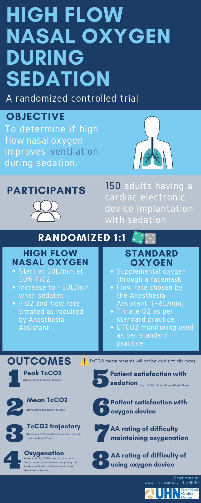

```{r setup, include=FALSE}
library(magrittr)
library(htmltools)
```

Home {data-navmenu="" data-icon="fa-home"}
=======================================================================

```{r home-chunk}
div(class="page", #wrapper for whole home page to set margin
div(class="jumbotron",    
h1(HTML("<em>High flow nasal oxygen during sedation in the cardiac catheterisation laboratory</em>")),
  p("A randomized controlled trial"),
HTML('<a class="button" href="">Click here to access the full review</a>')),
br(),
HTML('<h2>
<ul class="fa-ul">
<li><span class="fa-li"><i class="fad fa-info"></i></span> This webpage contains supplementary information for the trial. Make a selection from the menu above.</span>
          </li>
          </ul>
         </h2>'),
br(),
HTML('<div>
<h2>
<ul class="fa-ul">
<li><span class="fa-li"><i class="fad fa-users"></i></span> 
          Authors</span>
          </li>
          </ul>
<ul class="fa-ul">
 <li><span class="fa-li"><i class="fad fa-angle-double-right"></i></span><a href="https://www.aaronconway.info"> <em>Aaron Conway</em> </a> <p style="font-size:16px">Peter Munk Cardiac Centre, UHN &amp; Lawrence S. Bloomberg Faculty of Nursing, University of Toronto</p></li>
  
<li><span class="fa-li"><i class="fad fa-angle-double-right"></i></span><em>Navpreet Kamboj</em>  <p style="font-size:16px">Lawrence S. Bloomberg Faculty of Nursing, University of Toronto</p></li>
  
<li><span class="fa-li"><i class="fad fa-angle-double-right"></i></span><em>Kristina Chang</em> <p style="font-size:16px">Toronto General Hospital, UHN</p></li>
  
<li><span class="fa-li"><i class="fad fa-angle-double-right"></i></span><em>Matteo Parotto</em>  <p style="font-size:16px">Toronto General Hospital, UHN</p></li>
</ul>
</h2>
</div>
')
)
```

Methods {data-navmenu="" data-icon="<i class='fad fa-tools'></i>" }
=======================================================================

### Overview 

<div
 class="canva-embed"
 data-design-id="DADen_OjGzk"
 data-height-ratio="1.25000"
 style="padding:125.0000% 5px 5px 5px;background:rgba(0,0,0,0.03);border-radius:8px;"
></div>
<script async src="https:&#x2F;&#x2F;sdk.canva.com&#x2F;v1&#x2F;embed.js"></script>
<a href="https:&#x2F;&#x2F;www.canva.com&#x2F;design&#x2F;DADen_OjGzk&#x2F;view?utm_content=DADen_OjGzk&amp;utm_campaign=designshare&amp;utm_medium=embeds&amp;utm_source=link" target="_blank" rel="noopener"></a>

### Overview {.mobile}



Screening {data-navmenu=Participants data-icon="fa-check"}
=======================================================================

Column {data-width=550}
-----------------------------------------------------------------------

### CONSORT diagram

```{r consort-chunk}
knitr::include_graphics(here::here("plots/consort.png"))
```

Column {data-width=450}
-----------------------------------------------------------------------

### Reasons for exclusion

```{r exclusions-chunk}
drake::readd(exclusions_plot)
```

Characteristics {data-navmenu=Participants data-icon="fa-users"}
=======================================================================

### Participant characteristics

```{r characteristics-chunk}
drake::readd(characteristics_table)
```

Oxygen use {data-navmenu=Results data-orientation=rows data-icon="fa-tachometer"}
=======================================================================

Column {data-width = 500}
-----------------------------------------------------------------------

### Oxygen flow rate in litres per minute for each participant

```{r ox-flow-chunk}
drake::readd(oxygen_flow_plot)
```

### Oxygen flow rate in litres per minute as a proportion of the total time of all procedures per randomization group

```{r ox-prop-chunk}
drake::readd(oxygen_proportion_plot)
```

Column
-----------------------------------------------------------------------

### Oxygen to air ratio for each participant randomized to high flow nasal oxygen

```{r, fio2-chunk, fig.width = 16}
drake::readd(oxygen_fio2_plot)
```

Main results {data-navmenu=Results}
=======================================================================

Column
-----------------------------------------------------------------------


CO2/SPO2 data {data-navmenu=Results data-icon="fa-chart-bar"}
=======================================================================

Column
-----------------------------------------------------------------------

### Categories of recorded CO2 values during procedure for each participant

```{r, co2-chunk}
drake::readd(co2_plot)
```

Column
-----------------------------------------------------------------------

### Categories of recorded SPO2 values during procedure for each participant

```{r, spo2-chunk}
drake::readd(spo2_plot)
```

Codebook {data-navmenu=Data data-icon="fa-book"}
=======================================================================

Insert a codebook: https://rubenarslan.github.io/codebook/

View and download data {data-navmenu=Data data-icon="fa-database"}
=======================================================================

Column
-----------------------------------------------------------------------

### Data

```{r, datatable-chunk}
DT::datatable(drake::readd(trial_datatable), extensions = "Buttons", options = list(dom = "Bfrtip", buttons = c("copy", "csv", "excel")))
```
